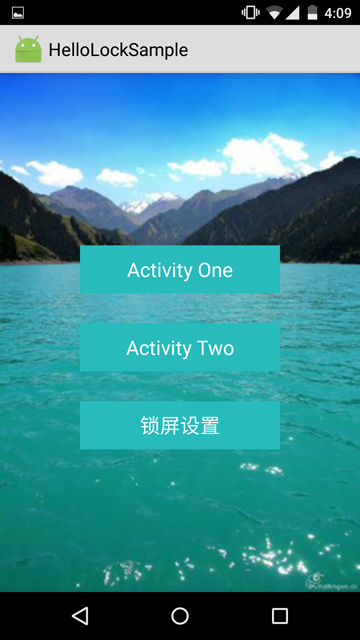
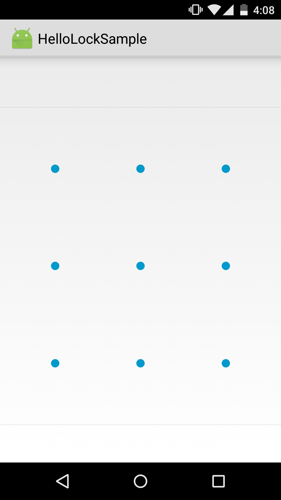
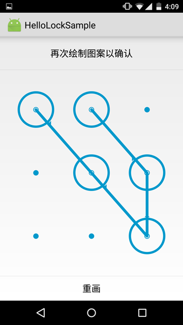
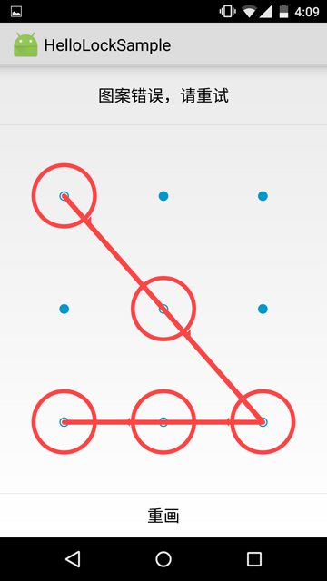

# HelloLock
an android library for you to lock your app

## Thanks
 Thanks to those two libs
  * https://github.com/wordpress-mobile/PasscodeLock-Android
  * https://github.com/DreaminginCodeZH/PatternLock

##  ScreenShoots







## USAGE:

1  Add the following line in onCreate of your App file :

   AppLockManager.getInstance().enableDefaultAppLockIfAvailable(this);

   And in your AndroidManifest, replace the default application by claiming android:name="yourApplication"

   within  application tag.

   For the  HelloLockSample, I create my own application: BaseApplication ,then claim it as follows

 ```xml
    <application android:allowBackup="true" android:label="@string/app_name"
           android:icon="@mipmap/ic_launcher" android:theme="@style/AppTheme.Light"
           android:name=".BaseApplication">
...

2  Open the file android.manifest and declare the following activities:

```xml
<activity android:name="com.micromingle.hellolock.PatternPreferencesActivity"></activity>
<activity android:name="com.micromingle.hellolock.PatternUnlockActivity"></activity>
<activity android:name="com.micromingle.hellolock.ManagerPatternActivity"></activity>
...

3  add the following items to you app theme:

```xml
<item name="android:windowDisablePreview">true</item>
<item name="patternViewStyle">@style/PatternView.Holo.Light</item>
 or
<item name="android:windowDisablePreview">true</item>
<item name="patternViewStyle">@style/PatternView.Holo</item>
...

4  call PatternPreferencesActivity to configure your pattern lock

 ```xml
 <item name="patternViewStyle">@style/PatternView.Holo</item>
 <!-- Or PatternView.Holo.Light, or your own style extending these two or not. -->
 ```