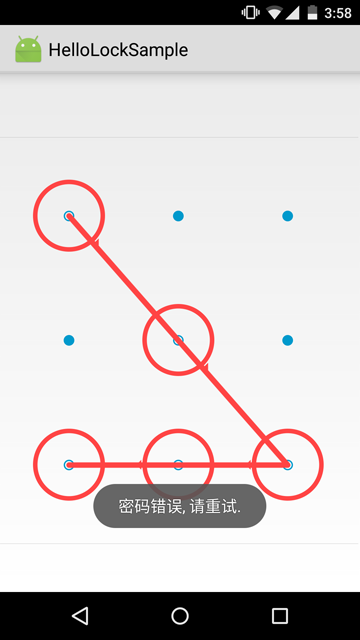

# HelloLock
an android library for you to lock your app

## Thanks
 Thanks to these two libs
  * https://github.com/wordpress-mobile/PasscodeLock-Android
  * https://github.com/DreaminginCodeZH/PatternLock

##  ScreenShoots




## USAGE:

```xml
1  Add the following line in onCreate of your App file :

   AppLockManager.getInstance().enableDefaultAppLockIfAvailable(this);

   And in your AndroidManifest, replace the default application with you custom Application

   within  application tag.

   As shown in  HelloLockSample, I create my own application :  BaseApplication ,then declare it as follows


  <application android:allowBackup="true" android:label="@string/app_name"
             android:icon="@mipmap/ic_launcher" android:theme="@style/AppTheme.Light"
             android:name=".BaseApplication">


2  Open the file AndroidManifest and declare the following activities:


  <activity android:name="com.micromingle.hellolock.PatternPreferencesActivity"></activity>
  <activity android:name="com.micromingle.hellolock.PatternUnlockActivity"></activity>
  <activity android:name="com.micromingle.hellolock.ManagerPatternActivity"></activity>


3  add the following items to you app theme:


  <item name="android:windowDisablePreview">true</item>
  <item name="patternViewStyle">@style/PatternView.Holo.Light</item>
   or
  <item name="android:windowDisablePreview">true</item>
  <item name="patternViewStyle">@style/PatternView.Holo</item>


4  call PatternPreferencesActivity to configure your pattern lock.

